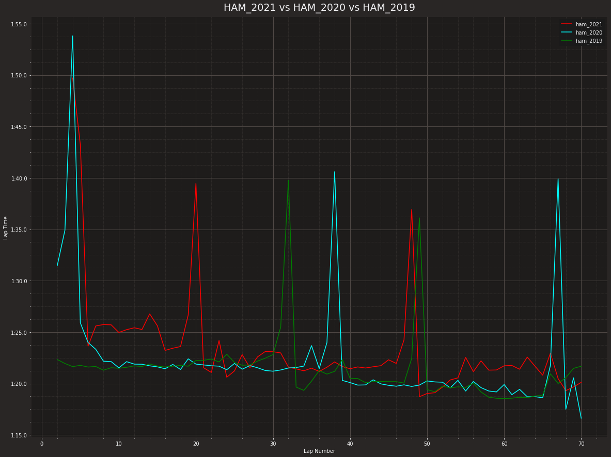

```python
#
import fastf1
from fastf1 import plotting
import numpy as np
import pandas as pd
import matplotlib.pyplot as plt
plotting.setup_mpl()
fastf1.Cache.enable_cache("C:\Program Files\JetBrains\PyCharm Community Edition 2022.1.1\cache")

#Load session data.
race_21 = fastf1.get_session(2021, 'Hungary', 'R')
race_21.load()
```

    core           INFO 	Loading data for Hungarian Grand Prix - Race [v2.2.9]
    api            INFO 	Using cached data for driver_info
    api            INFO 	Using cached data for timing_data
    api            INFO 	Using cached data for timing_app_data
    core           INFO 	Processing timing data...
    api            INFO 	Using cached data for session_status_data
    api            INFO 	Using cached data for track_status_data
    api            INFO 	Using cached data for car_data
    api            INFO 	Using cached data for position_data
    api            INFO 	Using cached data for weather_data
    api            INFO 	Using cached data for race_control_messages
    core           INFO 	Finished loading data for 20 drivers: ['31', '44', '55', '14', '10', '22', '6', '63', '33', '7', '3', '47', '99', '9', '4', '77', '11', '16', '18', '5']
    


```python
race_20 = fastf1.get_session(2020, 'Hungary', 'R')
race_20.load()
```

    core           INFO 	Loading data for Hungarian Grand Prix - Race [v2.2.9]
    api            INFO 	Using cached data for driver_info
    api            INFO 	Using cached data for timing_data
    api            INFO 	Using cached data for timing_app_data
    core           INFO 	Processing timing data...
    api            INFO 	Using cached data for session_status_data
    api            INFO 	Using cached data for track_status_data
    api            INFO 	Using cached data for car_data
    api            INFO 	Using cached data for position_data
    api            INFO 	Using cached data for weather_data
    api            INFO 	Using cached data for race_control_messages
    core           INFO 	Finished loading data for 19 drivers: ['44', '33', '77', '18', '23', '5', '11', '3', '55', '20', '16', '26', '4', '7', '8', '99', '63', '6', '10']
    


```python
race_19 = fastf1.get_session(2019, 'Hungary', 'R')
race_19.load()
```

    core           INFO 	Loading data for Hungarian Grand Prix - Race [v2.2.9]
    api            INFO 	Using cached data for driver_info
    api            INFO 	Using cached data for timing_data
    api            INFO 	Using cached data for timing_app_data
    core           INFO 	Processing timing data...
    api            INFO 	Using cached data for session_status_data
    api            INFO 	Using cached data for track_status_data
    api            INFO 	Using cached data for car_data
    api            INFO 	Using cached data for position_data
    api            INFO 	Using cached data for weather_data
    api            INFO 	Using cached data for race_control_messages
    core           INFO 	Finished loading data for 20 drivers: ['44', '33', '5', '16', '55', '10', '7', '77', '4', '23', '11', '27', '20', '3', '26', '63', '18', '99', '88', '8']
    


```python
ham_2021 = race_21.laps.pick_driver('HAM')
ham_2020 = race_20.laps.pick_driver('HAM')
```


```python
ham_2019 = race_19.laps.pick_driver('HAM')
```


```python
fig, ax = plt.subplots()
plt.rcParams["figure.figsize"] = (20,15)
ax.plot(ham_2021['LapNumber'], ham_2021['LapTime'], color='red')
ax.plot(ham_2020['LapNumber'], ham_2020['LapTime'], color='cyan')
ax.plot(ham_2019['LapNumber'], ham_2019['LapTime'], color='green')
ax.set_title("HAM_2021 vs HAM_2020 vs HAM_2019")
ax.set_xlabel("Lap Number")
ax.set_ylabel("Lap Time")
plt.legend(["ham_2021", "ham_2020", "ham_2019"], loc = "upper right")
plt.show()
```


    

    


```python

```
